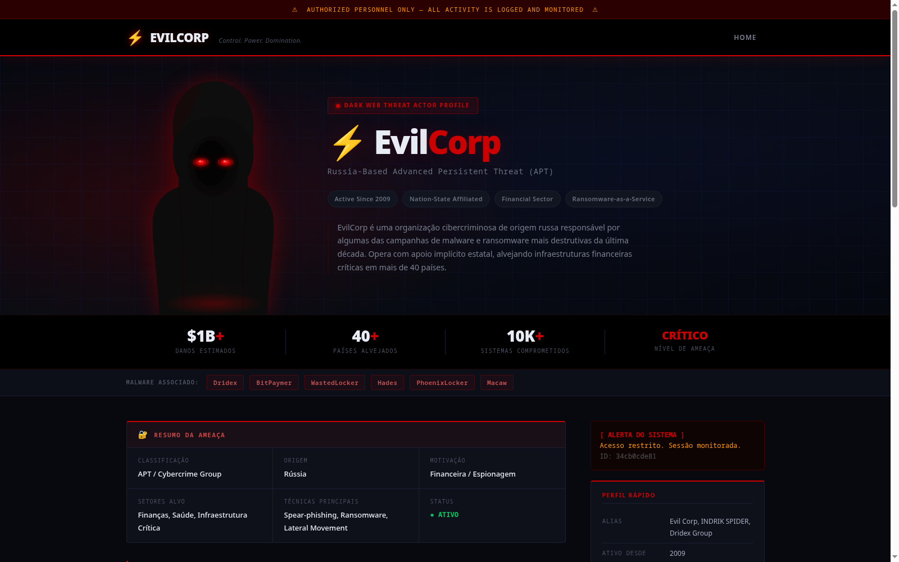

Autor: Roger Ribeiro de Oliveira

# EvilCorp — Portal Interno (CTF)



## Contexto

> "A melhor forma de combater o cybercrime é usar as próprias ferramentas do adversário contra ele — e vencê-lo no seu próprio terreno."

A **EvilCorp** é uma organização cibercriminosa de origem russa, ativa desde 2009, responsável por campanhas de malware bancário (Dridex) e ransomware corporativo (BitPaymer, WastedLocker, PhoenixLocker). O grupo já causou mais de **US$ 1 bilhão** em danos em mais de **40 países**, operando com aparente impunidade sob suspeita de proteção estatal.

Após meses de inteligência coletada por agências internacionais, um servidor da infraestrutura interna da EvilCorp foi identificado e isolado para análise. O servidor hospeda o **portal interno** do grupo — desenvolvido em WordPress — contendo documentos operacionais, credenciais e provas de atividade criminosa.

**Missão:** infiltrar a infraestrutura da EvilCorp e comprometer o servidor até obter acesso total (`root`), coletando as flags como prova do comprometimento. A ideia é usar o cybercrime contra o próprio criminoso — as mesmas técnicas que o grupo usa contra suas vítimas são empregadas aqui contra a infraestrutura dele.

**Objetivo:**
- `user.txt` — prova de comprometimento de uma conta interna da EvilCorp.
- `root.txt` — prova de controle total da infraestrutura.

Sem spoilers aqui: a cadeia de exploração fica por conta de quem for resolver o desafio. Happy hacking!

## Como montar o ambiente

### Requisitos

- Docker Engine ≥ 20.x
- Docker Compose ≥ 2.x

```bash
docker --version
docker compose version
```

### Subindo o ambiente

A imagem do servidor vulnerável está publicada no Docker Hub e é baixada automaticamente pelo Compose — não é necessário build local:

```bash
# Imagem disponível publicamente em:
docker pull pandadub/evilcorp-ctf:1.0

# Subir o ambiente completo
docker compose up -d

# Acompanhar a instalação
docker compose logs -f web
```

O ambiente cria automaticamente a rede `172.20.0.0/24` com dois containers em IPs distintos, simulando máquinas separadas em uma rede corporativa:

| Container      | IP            | Serviços                        |
|----------------|---------------|----------------------------------|
| `evilcorp_db`  | `172.20.0.XX` | MySQL 8.0 (acesso interno)       |
| `evilcorp_web` | `172.20.0.XX` | HTTPS (443), HTTP (80), SSH (22) |

O **TARGET_IP** do desafio é `172.20.0.XX`.

### Acesso via HTTPS

O servidor usa HTTPS com certificado autoassinado. Para `curl`, use a flag `-k`. Pelo navegador, aceite o aviso de segurança (Avançado → Prosseguir):

```bash
# Verificar acesso (deve retornar HTTP 200)
curl -sk https://172.20.0.XX -o /dev/null -w "%{http_code}"

# Extrair e instalar o certificado (opcional)
docker cp evilcorp_web:/etc/ssl/certs/evilcorp.crt /tmp/evilcorp.crt

# Arch/Manjaro
sudo cp /tmp/evilcorp.crt /etc/ca-certificates/trust-source/anchors/evilcorp.crt
sudo update-ca-trust

# Debian/Ubuntu
sudo cp /tmp/evilcorp.crt /usr/local/share/ca-certificates/evilcorp.crt
sudo update-ca-certificates
```

### Parando o ambiente

```bash
docker compose down        # para os containers (preserva o banco)
docker compose down -v     # reset completo (apaga o banco de dados)
```
